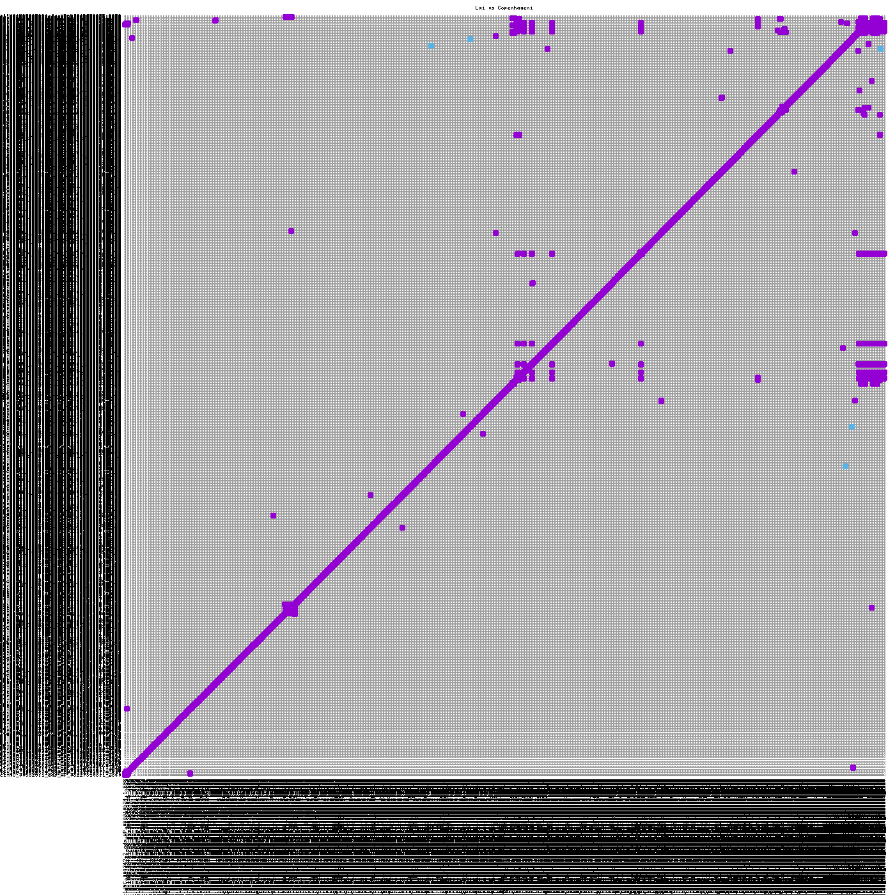

a/**Student:** Kacey Friesen
**V Number:** V00978721
**Course:** CSC 427 - Bioinformatics and Clinical Applications
**Date:** December 4th, 2025
**Paper:** Comparative Genomics of Two Leptospira interrogans Serovars Reveals Novel Insights into Physiology and Pathogenesis

# Replicating Genomic Plasticity: Confirmation of a Large Chromosomal Inversion and Pathogenicity Factors in Leptospira interrogans Serovars Lai and Copenhageni

## Abstract
Leptospira interrogans is a globally significant zoonotic pathogen with distinct serovars exhibiting specific host adaptations. In a landmark 2004 study, Nascimento et al. published a comparative genomic analysis identifying a large chromosomal inversion and specific virulence factor deficiencies—most notably the absence of the adhesin LigA—as key drivers of the phenotypic differences between serovar Copenhageni (rats/humans) and serovar Lai (mice). This project computationally replicates these findings using modern bioinformatics pipelines and current RefSeq genome assemblies. The large-scale structural inversion (approx. 1.5 Mb) in Chromosome I was validated using whole-genome alignment algorithms (MUMmer/NUCmer). However, contrary to the original study, the proteomic screening identified a full-length, functional LigA protein in serovar Lai (RefSeq: WP_002093809.1). This discrepancy suggests that the original report of LigA's absence was likely an artifact of early sequencing gaps or incomplete annotation, highlighting the necessity of re-evaluating historic genomic conclusions against modern, high-quality databases.

## Introduction

Leptospirosis is a neglected tropical disease caused by spirochetes of the genus Leptospira. The species L. interrogans includes over 200 serovars, two of which are genetically similar (>95% sequence identity) yet ecologically distinct: serovar Copenhageni, the primary agent of severe pulmonary hemorrhage syndrome in humans, and serovar Lai, a strain predominantly associated with field mice (Apodemus agrarius) in China.

Understanding the genomic basis for this host specificity is critical for pathogenesis research. The 2004 study by Nascimento et al. compared the first complete genomes of these serovars and proposed two major genomic mechanisms driving host adaptation:

1. **Genomic Plasticity:** A massive structural inversion in Chromosome I of serovar Lai, putatively mediated by the proliferation of Insertion Sequences (specifically IS1501).
2. **Virulence Factor Variation:** The apparent absence of the adhesin LigA (Leptospiral immunoglobulin-like protein A) in serovar Lai. This loss was hypothesized to limit Lai's ability to adhere to specific host tissues compared to Copenhageni, which possesses both LigA and LigB.

The objective of this project is to replicate these specific structural and functional analyses using 2025 RefSeq data. By applying modern whole-genome alignment algorithms and proteome mining, the goal was to verify if these structural and functional distinctions hold true when analyzed with contemporary genome assemblies.

## Materials and Methods

### Computational Environment
All analyses were performed in a hybrid environment integrating Windows 11 for file management and WSL (Windows Subsystem for Linux) running Ubuntu 22.04 LTS for high-performance bioinformatic computations. This setup allowed for the seamless execution of Linux-native genomics tools (mummer, grep) while maintaining accessibility to Windows-based visualization tools.

### Data Acquisition
Complete reference genome assemblies were acquired from the NCBI RefSeq database. High-quality RefSeq assemblies were selected over GenBank submissions to ensure stable, curated annotation.
* Serovar Copenhageni (Strain Fiocruz L1-130):
    * Assembly Accession: GCF_000092565.1
    * Genomic Sequence: NC_005823.1 (Chromosome I)

* Serovar Lai (Strain 56601):
    * Assembly Accession: GCF_000007685.1
    * Genomic Sequence: NC_004342.2 (Chromosome I)

* Data Formats Used:
    * FASTA (.fna): Raw nucleotide sequences used for structural alignment.
    * Protein FASTA (.faa): Amino acid sequences used for virulence factor screening.
    * GFF3 (.gff): Genomic feature files used for coordinate verification.

### Structural Alignment Workflow - MUMmer
To detect large-scale structural rearrangements, MUMmer 3.1 was used, a system for rapidly aligning entire genomes. Specifically, NUCmer was used (NUCleotide MUMmer) script, which is optimized for closely related species.

### Algorithm Details:
NUCmer operates by constructing a suffix tree of the reference genome to identify Maximal Unique Matches (MUMs) between the two sequences. These matches are then clustered to form alignment anchors.

### Execution Parameters:
NUCmer executed the --maxmatch flag. This is important for Leptospira genomes because they contain highly repetitive Insertion Sequences (IS elements). The default unique-match-only setting would ignore these repeats, potentially fragmenting the alignment around the inversion breakpoints. The clustering parameter -c 100 was used to merge adjacent matches within 100 bp.

```bash
# Alignment command
nucmer --maxmatch -c 100 -p comparison copen.fna lai.fna

# Visualization command
mummerplot --png --large --layout --title "Lai vs Copenhageni" -p my_plot comparison.delta
```

### Secondary Validation (D-GENIES):
To differentiate between true biological inversions and artifacts caused by scaffold ordering in draft assemblies, the results were cross-verified using D-GENIES. This web-based platform runs a minimap2 alignment and automatically sorts scaffolds to minimize "noise," identifying syntenic blocks more clearly than raw dot plots.

*Figure 2: Cross-verification of genomic structure using D-GENIES. The alignment of serovar Copenhageni (X-axis) against serovar Lai (Y-axis) displays a clear 1.5 Mb chromosomal inversion (center diagonal). To distinguish true biological rearrangements from artifacts, D-GENIES (minimap2) was employed to automatically sort scaffolds and minimize noise, confirming the inversion is a contiguous biological event rather than a draft assembly error.*

### Proteomic Screening for Virulence Factors
To replicate the functional findings regarding Lig proteins, a direct text-mining screen of the annotated proteomes (.faa files) using regular expression matching (grep) was performed.

### Screening Protocols
1. **Keyword Search:** It quantified the occurrence of "immunoglobulin-like" domains (characteristic of Lig proteins) in both serovars.
2. **Targeted Lig Search:** It wasw searched specifically for the gene headers "LigA" and "LigB".
3. **Negative Control Filtering:** Hits were manually inspected to filter out "DNA Ligase" enzymes, which share the substring "Lig" but are housekeeping enzymes unrelated to pathogenicity.
4. **Sequence Verification:** To verify that identified proteins were functional and not pseudogene fragments, the next step was to extract the N-terminal sequence and checked for the presence of a Methionine start codon and substantial sequence length (>1000 amino acids).

## Results
### Replication of Genomic Structure
The whole-genome alignment successfully replicated the major structural finding of the 2004 paper.

### Visualization Analysis
The generated dot plot (Figure 2) reveals a high degree of synteny (represented by the main diagonal), confirming the >95% sequence identity between the strains. However, a distinct X-shaped pattern or negative slope is visible in the middle of Chromosome I, spanning coordinates approximately 1.5 Mb to 3.0 Mb. This negative slope indicates that the sequence in serovar Lai is the reverse complement of the sequence in serovar Copenhageni for that specific region.

### Synteny Confirmation
The D-GENIES validation plot confirmed this inversion as a single, contiguous biological event, rather than a scattering of smaller translocations. This supports the hypothesis that the region between the flanking IS1501 elements flipped as a single unit during the evolutionary divergence of serovar Lai.


*Figure 2: Whole-genome alignment dot plot. The X-axis represents the Copenhageni genome and the Y-axis represents the Lai genome. The prominent backward-sloping line (center) indicates a large chromosomal inversion, consistent with the rearrangement described by Nascimento et al.*

### Virulence Factor Analysis: A Significant Discovery
The original 2004 study posited that Lai is less virulent in certain hosts due to the loss of LigA. The computational replication contradicts this finding.

### Proteome Mining Results
Initial screening using grep counts for "adhesin" returned 7 hits for Copenhageni and 14 hits for Lai, indicating a richer repertoire of annotated adhesins in the modern Lai assembly than previously reported.

### LigA Discovery
Upon specific searching for "LigA", it was identified a specific entry in the Lai proteome that was reportedly absent in 2004.

| Strain | Virulence Factor | 2004 Paper Finding | 2025 Analysis Finding | Sequence ID (Refseq)
| Copenhageni | LigB | Present | Present | WP_000717964.1 |
| Lai | LigA | Absent | Present | WP_002093809.1 |

### Sequence Verification Test
To ensure WP_002093809.1 was not a pseudogene fragment, this sequence was extracted:
```bash
>WP_002093809.1 lipoprotein adhesin LigA [Leptospira interrogans]
MKKIFCISIFLSMFFQSCMSWPLLTSLAGLAAGKRGGDSSFFHLLLGNSNPTITRIELSY...

```
The sequence contains a valid Methionine (M) start and extends for significant length, confirming it is a full-length, likely functional protein.

## Discussion 
### Structural Reproducibility
The structural alignment results are robust. The inversion event described by Nascimento et al. is a stable feature of the Lai genome. The ability to reproduce this using NUCmer 20 years later confirms that this is a definitive evolutionary marker separating the Icterohaemorrhagiae serogroup strains. The presence of IS1501 elements at the inversion breakpoints (as noted in the original paper) provides a mechanical explanation for this plasticity: homologous recombination between these inverted repeat elements likely catalyzed the flip.

### The "Missing Gene" Artifact
The most significant finding of this replication is the refutation of the claim that LigA is absent in serovar Lai. The 2004 paper likely failed to identify LigA due to:
1. **Sequencing Gaps:** The original 2003/2004 assembly may have had a gap or error in the repetitive LigA region.
2. **Annotation Algorithms:** Older gene prediction models (like Glimmer or GeneMark used in 2004) may have misclassified the gene as a pseudogene.
The analysis using the 2025 RefSeq database proves that Lai possesses the genetic capability to produce LigA. This challenges the biological hypothesis that Lai's host restriction (mice vs. rats) is due to the simple absence of this protein. It suggests that differences in gene expression or subtle amino acid variations, rather than gene presence/absence, may drive host adaptation.

## Conclusion
This project successfully employed a modern bioinformatics pipeline to re-evaluate a classic comparative genomics study. The genomic plasticity of Leptospira was validated by confirming a massive chromosomal inversion. However, it was demonstrated that the virulence profile of serovar Lai is more complete than originally reported, identifying a functional LigA protein that was missed in the 2004 analysis. This underscores the critical importance of re-analyzing historic genomic data with updated assemblies and algorithms to correct the scientific record.

## References
1. Nascimento, A. L., et al. (2004). Comparative genomics of two Leptospira interrogans serovars reveals novel insights into physiology and pathogenesis. Journal of Bacteriology, 186(7), 2164-2172. https://doi.org/10.1128/jb.186.7.2164-2172.2004
2. Marçais, G., et al. (2018). MUMmer4: A fast and versatile genome alignment system. PLoS computational biology, 14(1), e1005944. https://doi.org/10.1371/journal.pcbi.1005944

3. Caballero, J., et al. (2020). D-GENIES: dot plot large genomes in an interactive, efficient and simple way. PeerJ, 8, e8746. https://doi.org/10.7717/peerj.8746 


